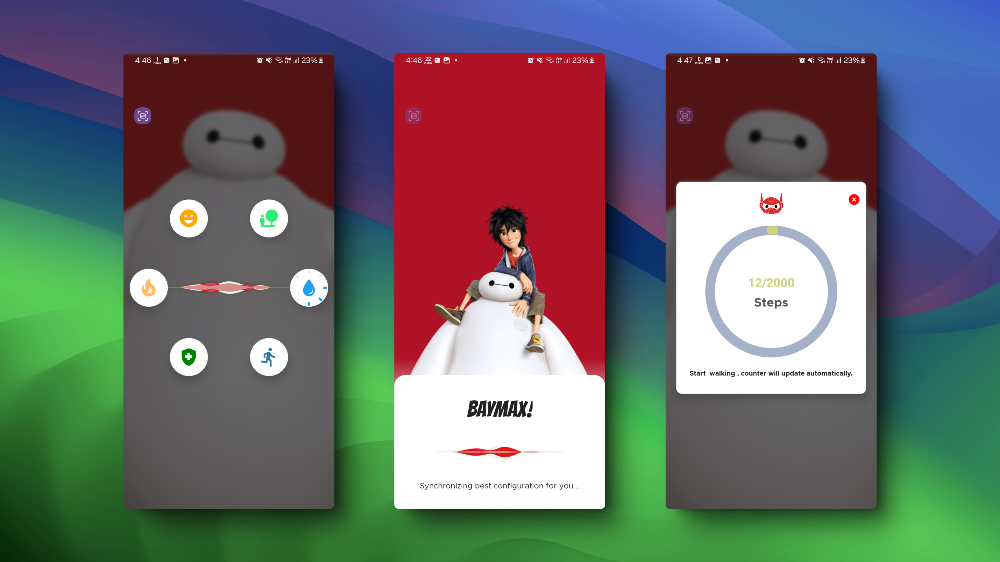

# Baymax - Personal Health Care Companion
## 👇Click Here to Watch Demo 

## Showcase Screenshots

---

## Overview

**Baymax** is your personal healthcare companion designed to help you stay on top of your daily wellness. The app helps you track your water intake, count your steps, and offers personalized health tips through the **Gemini API**. With the integration of a **Text-to-Speech (TTS) engine**, Baymax can also speak out health tips, making it easy for users to stay informed while on the go. Additionally, you'll receive reminders every 2 hours to drink water and keep hydrated.

---

## Features

- **Water Intake Tracker**: Easily track how much water you drink throughout the day and stay hydrated with 2-hour reminders.
- **Step Counter**: Automatically count your daily steps to help you meet your fitness goals.
- **Reminders for Water Intake**: Get notifications every 2 hours via **Firebase Cloud Messaging** with **Notifee** for drinking water.
- **Health Tips Integration**: Receive personalized health tips from **Gemini API** based on your activity and preferences.
- **Text-to-Speech (TTS)**: Health tips are spoken aloud using a TTS engine, allowing you to listen instead of reading.
- **Amazing UI**: Enjoy a sleek, user-friendly interface for an effortless experience.

---

## Tech Stack

- **React Native CLI**: Cross-platform mobile app development using React Native.
- **Zustand**: Simple and lightweight state management for managing global app state.
- **Firebase Cloud Messaging (Notifee)**: Push notifications for hydration reminders.
- **Gemini API**: Personalized health tips delivered directly to the app.
- **Text-to-Speech Engine**: Converts text-based health tips to speech.
- **React Native Step Counter**: Tracks your daily step count automatically.

---
## Contact
Kannaujiya00000@gmail.com

## License

This project is licensed under the MIT License - see the [LICENSE](LICENSE) file for details.

